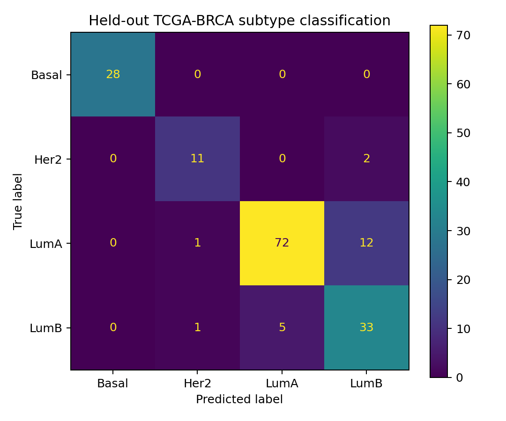
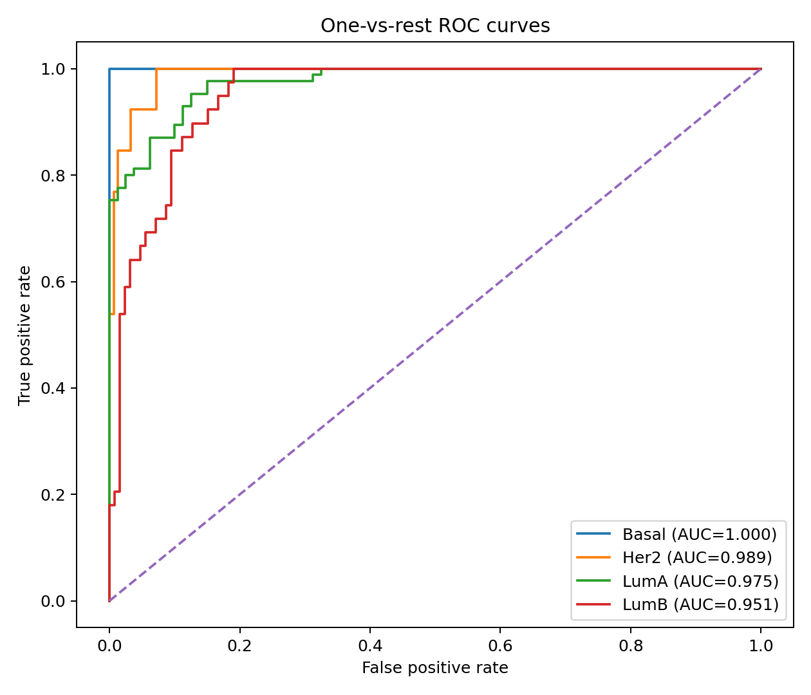
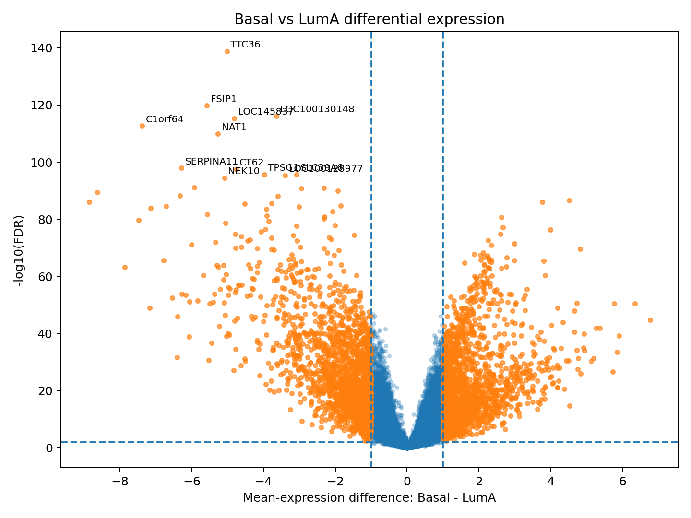
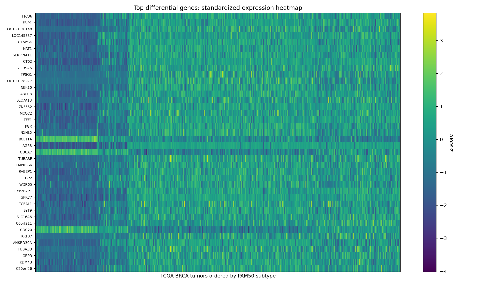

# TCGA-BRCA breast cancer subtype classification

[](https://github.com/laya-laya/tcga-brca-omics-classification/actions/workflows/ci.yml)

Machine-learning analysis of TCGA breast cancer transcriptomics: PAM50 subtype
classification with nested cross-validation and leakage control, feature
stability, differential expression and pathway interpretation, plus a
deployable version of the final model (batch prediction job, REST API, Docker
image, CI and data-drift monitoring).

## Quick start

### Option A — existing Python environment

The core workflow supports Python 3.8+.

```bash
python -m pip install -r requirements.txt
python scripts/download_tcga_brca.py
python scripts/run_nested_cv.py
python scripts/run_full_analysis.py
```

For pathway enrichment:

```bash
python -m pip install gprofiler-official
python scripts/run_enrichment.py
```

### Option B — isolated Conda environment

```bash
conda env create -f environment.yml
conda activate tcga-brca-ml
```

Then:

```bash
make download
make cv
make analysis
make heatmap
```

The scripts add `src/` to `sys.path`, so an editable package installation is
not required to run the analysis.


## Deployment: batch predictions, API and Docker

The final classifier is packaged for scoring new samples, with the checks a
model needs once it leaves the notebook.

| Piece | What it does |
| --- | --- |
| `scripts/train_model.py` | Refits the model chosen by nested CV on the training split, evaluates once on the held-out split, and saves a model bundle (`models/pam50_classifier.joblib`) plus a model card (`models/pam50_classifier.json`). |
| `tcga_brca.predict` | Batch job: validates the input genes, predicts subtypes with probabilities, and writes a CSV plus a JSON report (validation, drift, prediction summary). |
| `tcga_brca.api` | FastAPI service with `/health`, `/model` and `/predict`, sharing the batch job's prediction code. |
| `tcga_brca.drift` | Per-gene data-drift check of new samples against the training distribution. |
| `Dockerfile` | One image with pinned dependencies for training, batch prediction and serving. |
| `.github/workflows/ci.yml` | Runs the tests on Python 3.10 and 3.12, builds the image, and smoke-tests the batch job and the API. |

### Try it without downloading TCGA

```bash
make demo    # synthetic data: trains a demo model, scores a clean and a shifted batch
```

### Train and run locally

```bash
make download                                   # once
make train                                      # -> models/pam50_classifier.joblib
make predict INPUT=data/new/samples.tsv.gz      # -> predictions/predictions.csv + .report.json
make serve                                      # API at http://localhost:8000/docs
```

### With Docker

```bash
make docker-train                                     # download + train inside the pinned image
make docker-predict INPUT=data/new/samples.tsv.gz     # batch job in a container
make docker-serve                                     # API on port 8000
```

New samples use the training format: UCSC Xena layout (genes as rows, samples
as columns, HiSeqV2 log2 expression, gene symbols). Use `--samples-as-rows`
for a samples x genes CSV.

### Safeguards

- **Input validation.** Unknown genes are ignored, column order does not
  matter, and occasional gaps are filled with training medians. A batch is
  rejected (exit code 2, HTTP 422) if more than 5% of the genes the model
  uses are missing.
- **Data drift.** For each gene the model uses, the new batch is binned on
  training deciles and compared with the Population Stability Index (PSI,
  corrected for the upward bias of small batches) and a two-sample chi-square
  test with Benjamini-Hochberg FDR control. A gene counts as drifted when
  q < 0.05 and adjusted PSI >= 0.2; the batch is flagged when more than 10% of
  genes drift. `--fail-on-drift` exits with code 3, so a scheduler can stop
  downstream steps.
- **Prediction monitoring.** Every report includes the predicted subtype
  counts, mean confidence and the share of low-confidence predictions.
- **Reproducibility.** The bundle records the Python and scikit-learn versions
  and warns on a mismatch; the Docker image pins all dependencies.

How reliable is the drift check? `make simulate-drift` scores simulated
batches against a reference of TCGA size (share of batches flagged, 100 per
cell; shift applied to half of the genes):

| Shift (gene SD) | n = 10 | n = 30 | n = 100 | n = 400 |
| --- | --- | --- | --- | --- |
| 0 (no drift) | 0% | 0% | 0% | 0% |
| 0.25 | 0% | 0% | 0% | 0% |
| 0.5 | 0% | 12% | 100% | 100% |
| 1 | 0% | 100% | 100% | 100% |
| 2 | 100% | 100% | 100% | 100% |

No false alarms at any batch size; shifts of half a standard deviation are
caught from about 100 samples, and large shifts from 10.

## Data

The repository does **not** commit TCGA data. The downloader retrieves:

- UCSC Xena `TCGA.BRCA.sampleMap/HiSeqV2`
- UCSC Xena `TCGA.BRCA.sampleMap/BRCA_clinicalMatrix`

See [`data/README.md`](data/README.md) for details.


## Results

### Model selection

Nested cross-validation compared Elastic-Net logistic regression with a
Random Forest classifier on the training partition.

| Model | Balanced accuracy | Macro F1 | Macro ROC-AUC |
|---|---:|---:|---:|
| Elastic Net | 0.901 ± 0.041 | 0.888 ± 0.042 | 0.987 ± 0.005 |
| Random Forest | 0.870 ± 0.049 | 0.883 ± 0.050 | 0.981 ± 0.012 |

Elastic Net was therefore selected for final training and held-out evaluation.

### Held-out TCGA-BRCA performance

The final Elastic-Net model was evaluated on the untouched 20% test partition.

| Metric | Estimate |
|---|---:|
| Balanced accuracy | 0.885 |
| Macro F1 | 0.876 |
| Weighted F1 | 0.876 |
| Macro one-vs-rest ROC-AUC | 0.979 |

Bootstrap 95% intervals:

| Metric | 95% interval |
|---|---:|
| Balanced accuracy | 0.818–0.940 |
| Macro F1 | 0.810–0.925 |
| Weighted F1 | 0.825–0.923 |
| Macro ROC-AUC | 0.966–0.990 |

Importantly, PAM50-defining genes were excluded from the predictive feature
matrix. The results therefore show that broader transcriptomic patterns retain
substantial information about PAM50 subtype structure.

### Classification errors

The main classification ambiguity occurred between Luminal A and Luminal B,
while Basal tumors were completely separated in this particular held-out split.



### ROC analysis

One-vs-rest ROC-AUC values on the held-out test set were:

- Basal: 1.000
- HER2-enriched: 0.989
- Luminal A: 0.975
- Luminal B: 0.951



### Basal vs Luminal A transcriptomic differences

Differential-expression analysis was performed separately from the prediction
pipeline using the full transcriptome. Genes were tested using Welch's
t-test and corrected for multiple testing using the Benjamini-Hochberg
procedure.

Positive expression differences indicate higher expression in Basal tumors;
negative differences indicate higher expression in Luminal A tumors.



### Feature-selection stability

Feature selection was repeated across cross-validation folds to determine
which transcripts were consistently retained by the predictive pipeline.

Several genes were selected in all five stability folds, including AR, NCAPG,
NCAPH, HMGA1, NEIL3, CDCA8, CDCA5, FOXM1, CCNA2, XBP1, SPDEF and SERPINA11.

These genes should be interpreted as reproducible predictive features rather
than causal subtype drivers.


